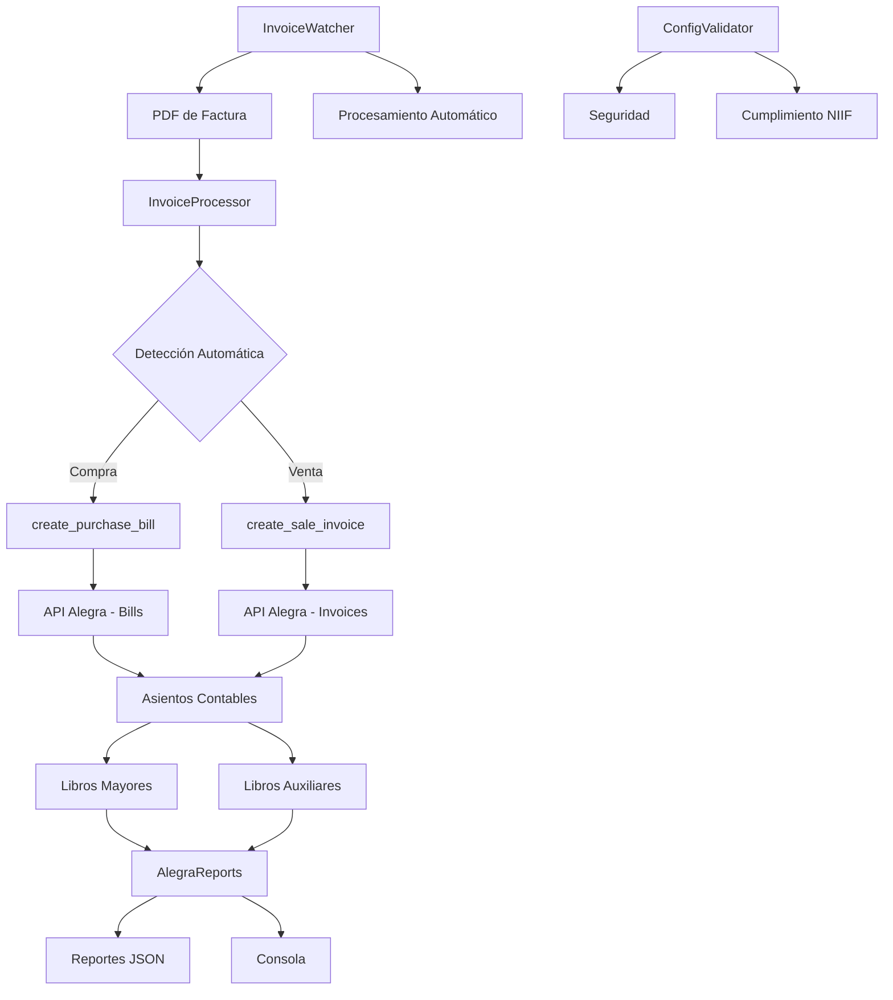

# InvoiceBot - Bot Contable Inteligente

## 🚀 Descripción

InvoiceBot es un sistema inteligente de procesamiento de facturas que evoluciona de un simple procesador de PDFs a un **bot contable completo** con integración total a Alegra. El sistema detecta automáticamente el tipo de factura (compra/venta), extrae datos con alta precisión, y organiza todo en libros mayores y menores a través de la API de Alegra.

## ✨ Características Principales

### 🔍 Detección Automática
- **Detección inteligente** de tipo de factura (compra vs venta) basada en keywords y patrones
- **Parsing robusto** con múltiples patrones de regex para máxima compatibilidad
- **Extracción precisa** de fechas, totales, impuestos, y productos
- **Soporte multi-formato**: Procesa PDFs, JPG, PNG con OCR avanzado

### 📊 Integración Contable Completa
- **Facturas de Venta**: Crea invoices en Alegra automáticamente
- **Facturas de Compra**: Crea bills en Alegra para generar asientos contables
- **Gestión de Contactos**: Crea automáticamente proveedores y clientes
- **Gestión de Items**: Crea productos/servicios dinámicamente

### 📈 Reportes Contables
- **Libro Mayor General**: Reporte completo de todas las cuentas
- **Balance de Prueba**: Verificación de saldos contables
- **Diario General**: Registro cronológico de asientos
- **Libros Auxiliares**: Ledgers por proveedor/cliente específico

### 🤖 Automatización
- **Monitoreo en Tiempo Real**: Procesa PDFs e imágenes automáticamente al detectarlos
- **Clasificación Inteligente**: Organiza archivos por tipo y fecha
- **Backup Automático**: Registro local de todas las transacciones
- **Manejo de Errores**: Sistema robusto de recuperación
- **OCR Inteligente**: Extracción de texto de imágenes con preprocesamiento avanzado

### 🔒 Seguridad y Cumplimiento
- **Validación de Configuración**: Verificación automática de seguridad
- **Cumplimiento NIIF**: Preparado para estándares contables
- **Logging Completo**: Auditoría detallada de todas las operaciones
- **Manejo Seguro de Credenciales**: Variables de entorno protegidas

## 🏗️ Arquitectura del Sistema



## 📋 Requisitos

### Dependencias
```bash
pip install -r requirements.txt
```

**Nota**: Para procesamiento de imágenes (JPG/PNG), también necesitas instalar Tesseract OCR:
- **macOS**: `brew install tesseract`
- **Ubuntu/Debian**: `sudo apt-get install tesseract-ocr`
- **Windows**: Descargar desde [GitHub Tesseract](https://github.com/UB-Mannheim/tesseract/wiki)

### Variables de Entorno (.env)
```env
ALEGRA_USER=tu_email@ejemplo.com
ALEGRA_TOKEN=tu_token_de_alegra
ALEGRA_BASE_URL=https://api.alegra.com/api/v1
```

### Estructura de Directorios
```
betibot/
├── logs/                    # Logs del sistema
├── reports/                 # Reportes generados
├── facturas/               # PDFs a procesar
│   ├── processed/          # PDFs procesados exitosamente
│   └── error/              # PDFs con errores
├── backup/                 # Respaldo de datos
└── config/                 # Archivos de configuración
```

## 🚀 Uso

### 1. Procesamiento Manual de Facturas

```bash
# Procesar una factura PDF (detección automática)
python invoice_processor_enhanced.py process /ruta/a/factura.pdf

# Procesar una imagen de factura (JPG/PNG)
python invoice_processor_enhanced.py process /ruta/a/factura.jpg
python invoice_processor_enhanced.py process /ruta/a/factura.png

# Generar reportes contables
python invoice_processor_enhanced.py report --start-date 2024-01-01 --end-date 2024-01-31
```

### 2. Monitoreo Automático

```bash
# Iniciar monitoreo de carpeta (PDFs e imágenes)
python invoice_watcher.py /ruta/a/carpeta/facturas

# Con logging detallado
python invoice_watcher.py /ruta/a/carpeta/facturas --log-level DEBUG
```

**Tipos de archivo soportados**:
- 📄 **PDF**: Procesamiento nativo con pdfplumber
- 🖼️ **JPG/JPEG**: OCR con Tesseract + preprocesamiento OpenCV
- 🖼️ **PNG**: OCR con Tesseract + preprocesamiento OpenCV

### 3. Validación de Configuración

```bash
# Validar configuración y seguridad
python config_validator.py --report

# Generar reporte de seguridad
python config_validator.py --report --fix
```

### 4. Reportes Específicos

```bash
# Reporte de ledger general
python alegra_reports.py general-ledger --start-date 2024-01-01 --end-date 2024-01-31

# Balance de prueba
python alegra_reports.py trial-balance --start-date 2024-01-01 --end-date 2024-01-31

# Ledger auxiliar de un proveedor específico
python alegra_reports.py auxiliary-ledger --contact-id 123 --start-date 2024-01-01 --end-date 2024-01-31
```

## 📊 Flujo de Procesamiento Contable

### Para Facturas de Compra:
1. **Detección**: Sistema identifica automáticamente como compra
2. **Extracción**: Parsea datos del PDF (proveedor, productos, totales)
3. **Creación de Contacto**: Crea/actualiza proveedor en Alegra
4. **Creación de Items**: Crea productos/servicios si no existen
5. **Creación de Bill**: Genera factura de compra en Alegra
6. **Asiento Contable**: Alegra genera automáticamente el asiento
7. **Backup Local**: Guarda registro local como respaldo

### Para Facturas de Venta:
1. **Detección**: Sistema identifica automáticamente como venta
2. **Extracción**: Parsea datos del PDF (cliente, productos, totales)
3. **Creación de Contacto**: Crea/actualiza cliente en Alegra
4. **Creación de Items**: Crea productos/servicios si no existen
5. **Creación de Invoice**: Genera factura de venta en Alegra
6. **Asiento Contable**: Alegra genera automáticamente el asiento

## 🔧 Configuración Avanzada

### Personalización de Patrones de Detección

El sistema usa patrones configurables para detectar tipos de factura. Puedes modificar los keywords en `invoice_processor_enhanced.py`:

```python
# Keywords para compra
compra_keywords = [
    'proveedor', 'proveedores', 'compra', 'compras', 'factura de compra',
    'bill', 'purchase', 'supplier', 'vendor'
]

# Keywords para venta
venta_keywords = [
    'cliente', 'clientes', 'venta', 'ventas', 'factura de venta',
    'invoice', 'sale', 'customer'
]
```

### Configuración de Logging

```python
# Niveles disponibles: DEBUG, INFO, WARNING, ERROR
logging.basicConfig(
    level=logging.INFO,
    format='%(asctime)s - %(levelname)s - %(message)s'
)
```

## 📈 Monitoreo y Mantenimiento

### Logs del Sistema
- `logs/invoicebot.log`: Logs principales del procesador
- `logs/invoice_watcher.log`: Logs del monitoreo automático
- `logs/config_validator.log`: Logs de validación de configuración

### Reportes Generados
- `reports/general-ledger_*.json`: Libro mayor general
- `reports/trial-balance_*.json`: Balance de prueba
- `reports/journal_*.json`: Diario general
- `reports/auxiliary-ledger_*.json`: Libros auxiliares

### Archivos de Respaldo
- `facturas_compra_YYYYMMDD.json`: Registro JSON de compras
- `facturas_compra_YYYYMMDD.txt`: Registro de texto de compras

## 🚨 Solución de Problemas

### Error: "Faltan credenciales de Alegra"
```bash
# Verificar archivo .env
cat .env

# Validar configuración
python config_validator.py --report
```

### Error: "No se pudo extraer datos del PDF"
- Verificar que el PDF no esté protegido por contraseña
- Comprobar que el PDF contenga texto (no solo imágenes)
- Revisar logs para detalles específicos del error

### Error: "Error en API Alegra"
- Verificar conectividad a internet
- Comprobar que las credenciales sean válidas
- Revisar límites de rate limiting de Alegra

## 🔄 Actualizaciones y Mejoras

### Próximas Características
- [ ] Integración con email para procesar adjuntos
- [ ] Interfaz web para monitoreo
- [ ] Exportación a Excel de reportes
- [ ] Integración con otros sistemas contables
- [ ] Machine Learning para mejor detección de patrones

### Contribuciones
1. Fork del repositorio
2. Crear rama para nueva característica
3. Implementar cambios con tests
4. Crear Pull Request

## 📞 Soporte

Para soporte técnico o reportar bugs:
1. Revisar logs del sistema
2. Ejecutar `python config_validator.py --report`
3. Crear issue en el repositorio con logs y detalles

## 📄 Licencia

Este proyecto está bajo la Licencia MIT. Ver archivo LICENSE para más detalles.

---

**InvoiceBot** - Transformando el procesamiento de facturas en automatización contable inteligente 🚀