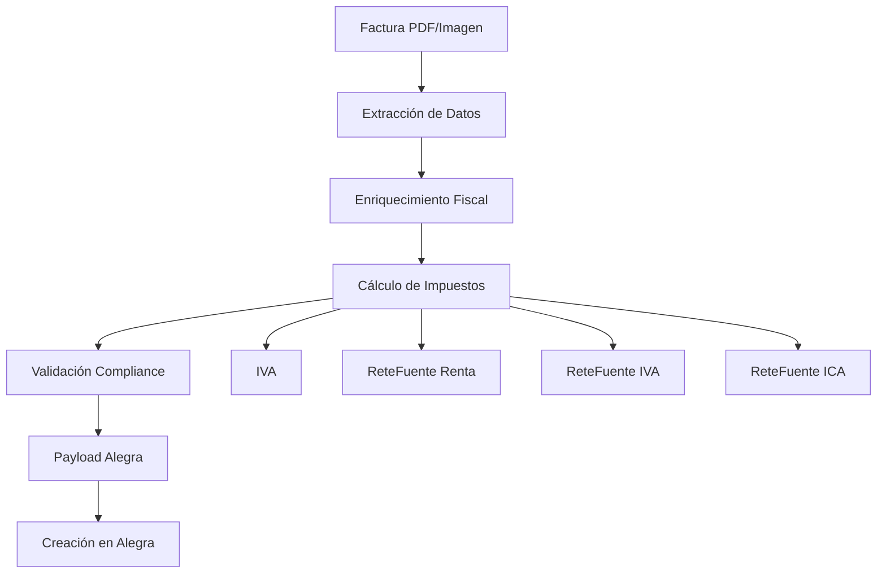

# 🧾 Sistema de Impuestos Colombianos 2025

Sistema completo de cálculo de impuestos para Colombia basado en la normativa DIAN 2025 y la Reforma Tributaria 2022/2023.

## 📋 Características

### ✅ **Impuestos Implementados**
- **IVA (Impuesto al Valor Agregado)**: 19% general, 5% reducida, 0% exento
- **Retención en la Fuente por Renta**: 2.5%-11% según tipo de pago
- **Retención en la Fuente por IVA**: 15% sobre el IVA generado
- **Retención en la Fuente por ICA**: 0.2%-1.4% según ciudad y actividad

### ✅ **Normativa 2025**
- **UVT 2025**: $49,799 (Unidad de Valor Tributario)
- **Umbrales actualizados**: ReteFuente Renta desde 2 UVT, ReteFuente IVA desde 10 UVT
- **Tasas actualizadas**: Basadas en Decreto 572/2025 y 771/2025
- **Compliance automático**: Validación de cálculos vs. facturas

### ✅ **Integración Completa**
- **Alegra API**: Payload completo con impuestos y retenciones
- **Nanobot**: Resolución de casos ambiguos
- **Validación fiscal**: Compliance automático
- **Reportes**: Consolidado de impuestos

## 🚀 Uso Rápido

### Instalación
```bash
# Instalar dependencias
pip install pandas openpyxl pdfplumber

# Configurar credenciales de Alegra
python3 setup_alegra_credentials.py
```

### Uso Básico
```python
from tax_calculator import ColombianTaxCalculator, InvoiceData

# Crear calculador
calculator = ColombianTaxCalculator()

# Datos de la factura
invoice_data = InvoiceData(
    base_amount=203343.81,
    total_amount=213511.00,
    iva_amount=10167.19,
    iva_rate=0.05,
    item_type="pet_food",
    description="ROYAL CANIN GATO GASTROINTESTINAL FIBRE x2KG",
    vendor_nit="52147745-1",
    vendor_regime="comun",
    vendor_city="bogota",
    buyer_nit="1136886917",
    buyer_regime="comun",
    buyer_city="bogota",
    invoice_date="2025-10-10",
    invoice_number="21488"
)

# Calcular impuestos
tax_result = calculator.calculate_taxes(invoice_data)

# Mostrar resumen
print(calculator.get_tax_summary(tax_result))

# Crear payload para Alegra
alegra_payload = calculator.create_alegra_payload(tax_result)
```

## 📊 Ejemplos de Cálculo

### Escenario 1: Alimento para Mascotas (Sin Retenciones)
```
💰 Base: $203,343.81
🧾 IVA (5.0%): $10,167.19
💵 Total: $213,511.00
📋 Retenciones: $0.00
💸 Neto a Pagar: $213,511.00
```

**Explicación:**
- IVA 5%: Alimento para mascotas tiene tasa reducida
- Sin ReteFuente Renta: Monto < 27 UVT para compras de bienes
- Sin ReteFuente IVA: Monto < 10 UVT
- Sin ReteFuente ICA: Misma ciudad

### Escenario 2: Honorarios Profesionales (Con Retenciones)
```
💰 Base: $3,000,000.00
🧾 IVA (19.0%): $570,000.00
💵 Total: $3,570,000.00
📋 Retenciones: $432,900.00
   • Renta: $330,000.00 (11%)
   • IVA: $85,500.00 (15%)
   • ICA: $17,400.00 (0.58%)
💸 Neto a Pagar: $3,137,100.00
```

**Explicación:**
- IVA 19%: Servicios profesionales
- ReteFuente Renta 11%: Honorarios > 27 UVT
- ReteFuente IVA 15%: Monto > 10 UVT
- ReteFuente ICA 0.58%: Diferente ciudad

## 🏗️ Arquitectura

### Componentes Principales

1. **`tax_calculator.py`**: Calculador principal de impuestos
2. **`config/tax_rules_CO_2025.json`**: Configuración fiscal 2025
3. **`invoice_processor_with_taxes.py`**: Procesador integrado
4. **`tax_nanobot_integration.py`**: Integración con Nanobot
5. **`test_tax_system.py`**: Suite de pruebas

### Flujo de Procesamiento



## 📋 Configuración Fiscal

### Tasas de IVA 2025
| Categoría | Tasa | Ejemplos |
|-----------|------|----------|
| General | 19% | Electrónicos, ropa |
| Reducida | 5% | Alimentos para mascotas, vehículos eléctricos |
| Exento | 0% | Alimentos básicos, exportaciones |
| Excluido | - | Educación, salud pública |

### Retención en la Fuente Renta
| Concepto | Tasa | Umbral (UVT) |
|----------|------|--------------|
| Honorarios > 27 UVT | 11% | 2 UVT |
| Honorarios ≤ 27 UVT | 10% | 2 UVT |
| Arrendamientos | 3.5% | 2 UVT |
| Compras (declarante) | 2.5% | 27 UVT |
| Compras (no declarante) | 3.5% | 27 UVT |
| Servicios generales | 4% | 4 UVT |

### Retención en la Fuente IVA
- **Umbral**: 10 UVT ($497,990)
- **Tasa común**: 15% sobre el IVA
- **Tasa gran contribuyente**: 50% sobre el IVA

### Retención en la Fuente ICA
| Ciudad | Comercio | Industria | Servicios |
|--------|----------|-----------|-----------|
| Bogotá | 0.414% | 1.104% | 0.690% |
| Medellín | 0.350% | 0.950% | 0.580% |
| Cali | 0.380% | 1.020% | 0.620% |
| Barranquilla | 0.320% | 0.850% | 0.520% |

## 🧪 Pruebas

### Ejecutar Pruebas
```bash
# Pruebas completas
python3 test_tax_system.py

# Demostración
python3 demo_tax_system.py

# Prueba simple
python3 test_tax_simple.py
```

### Casos de Prueba
- ✅ Cálculo de IVA por categorías
- ✅ ReteFuente Renta por tipo de pago
- ✅ ReteFuente IVA por umbrales
- ✅ ReteFuente ICA por ciudades
- ✅ Validación de compliance
- ✅ Integración con Alegra

## 🔧 Configuración Avanzada

### Personalizar Tasas
Editar `config/tax_rules_CO_2025.json`:
```json
{
  "iva_categories": {
    "mi_categoria": {
      "rate": 0.19,
      "description": "Mi categoría personalizada"
    }
  }
}
```

### Agregar Ciudades ICA
```json
{
  "retefuente_ica": {
    "cities": {
      "mi_ciudad": {
        "threshold_uvt": 5,
        "rates": {
          "comercio": 0.004,
          "industria": 0.010,
          "servicios": 0.006
        }
      }
    }
  }
}
```

## 📈 Monitoreo y Reportes

### Reporte Fiscal Consolidado
```python
# Generar reporte
processor = TaxIntegratedInvoiceProcessor()
report = processor.generate_tax_report(processing_results)

print(f"Total facturas: {report['total_invoices']}")
print(f"Total IVA: ${report['summary']['total_iva']:,.2f}")
print(f"Total retenciones: ${report['summary']['total_withholdings']:,.2f}")
```

### Métricas de Compliance
- Facturas compliant vs. con advertencias
- Desviaciones en cálculos de IVA
- Errores de validación fiscal

## 🚨 Troubleshooting

### Problemas Comunes

1. **Error de serialización JSON**
   ```python
   # Usar valores numéricos en lugar de métodos
   "rate": 0.15  # ✅ Correcto
   "rate": self._get_rate()  # ❌ Incorrecto
   ```

2. **Cálculos incorrectos de ReteFuente**
   - Verificar umbrales UVT
   - Confirmar régimen fiscal
   - Validar tipo de pago

3. **Validación de compliance fallida**
   - Revisar tolerancia de diferencias
   - Verificar extracción de datos
   - Confirmar configuración fiscal

## 📚 Referencias

- [DIAN - Impuestos 2025](https://www.dian.gov.co)
- [Reforma Tributaria 2022/2023](https://www.minhacienda.gov.co)
- [Decreto 572/2025](https://www.dian.gov.co)
- [Decreto 771/2025](https://www.dian.gov.co)

## 🤝 Contribuciones

Para contribuir al sistema de impuestos:

1. Actualizar configuración fiscal en `config/tax_rules_CO_2025.json`
2. Agregar casos de prueba en `test_tax_system.py`
3. Documentar cambios en `README_TAX_SYSTEM.md`
4. Validar compliance con normativa DIAN

## 📄 Licencia

Sistema de impuestos desarrollado para InvoiceBot/Supervincent.
Cumple con normativa fiscal colombiana 2025.

---

**¡Sistema de impuestos listo para producción! 🚀**