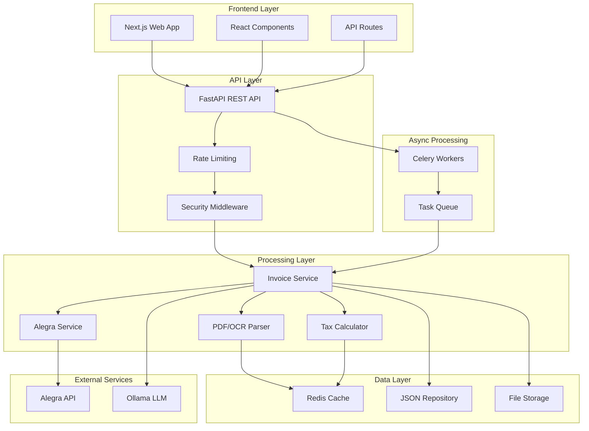
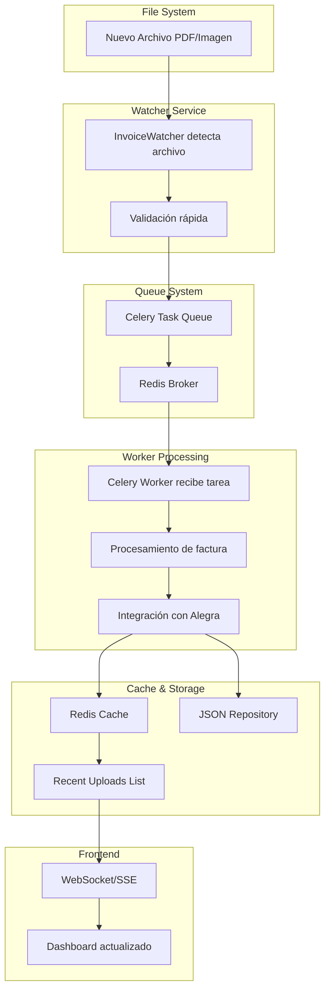

# SuperVincent InvoiceBot - Documento de Requerimientos Técnicos

## Tabla de Contenidos

1. [Visión General del Proyecto](#1-visión-general-del-proyecto)
2. [Estructura de Carpetas y Archivos](#2-estructura-de-carpetas-y-archivos)
3. [Backend](#3-backend)
4. [Data Streams y Procesamiento en Tiempo Real](#4-data-streams-y-procesamiento-en-tiempo-real)
5. [Frontend](#5-frontend)
6. [Base de Datos](#6-base-de-datos)
7. [Infraestructura y Despliegue](#7-infraestructura-y-despliegue)
8. [Cómo Ejecutar el Proyecto Localmente](#8-cómo-ejecutar-el-proyecto-localmente)
9. [Próximos Pasos / Roadmap](#9-próximos-pasos--roadmap)

---

## 1. Visión General del Proyecto

### 1.1 Objetivo del Proyecto

**SuperVincent InvoiceBot** es un sistema inteligente de procesamiento de facturas que automatiza la extracción de datos de facturas (PDF e imágenes), calcula impuestos colombianos (IVA, ReteFuente, ICA), detecta automáticamente el tipo de factura (compra/venta), e integra con el sistema contable **Alegra** para crear automáticamente facturas de compra (bills) y venta (invoices), generando asientos contables y reportes financieros completos.

### 1.2 Tecnologías Utilizadas

#### Backend
- **Framework**: FastAPI 0.104+ (Python 3.11+)
- **Procesamiento de PDFs**: pdfplumber 0.10.3
- **OCR**: pytesseract 0.3.10 + Tesseract OCR
- **Procesamiento de Imágenes**: OpenCV 4.10.0.84, Pillow 10.0.0
- **Async Processing**: aiohttp 3.9.1, Celery 5.3.4
- **Cache**: Redis 5.0.1
- **Validación**: Pydantic 2.5.0
- **HTTP Client**: requests 2.31.0
- **Integración Contable**: alegra-python 0.1.3
- **Monitoreo de Archivos**: watchdog 3.0.0

#### Frontend
- **Framework**: Next.js 14.0.0 (React 18.2.0)
- **Lenguaje**: TypeScript 5.0.0
- **Estilos**: Tailwind CSS 3.3.0
- **HTTP Client**: Axios 1.13.2
- **Gráficos**: Recharts 2.8.0
- **Iconos**: Lucide React 0.294.0

#### Infraestructura
- **Contenedores**: Docker, Docker Compose
- **Base de Datos Cache**: Redis 7-alpine
- **Task Queue**: Celery con Redis como broker
- **Servidor Web**: Uvicorn (ASGI)

#### Servicios Externos
- **Alegra API**: Sistema contable en la nube (Colombia)
- **Ollama** (Opcional): Modelos LLM locales para procesamiento avanzado

### 1.3 Arquitectura General



**Flujo de Procesamiento Principal:**

```
Archivo PDF/Imagen 
    ↓
Validación de Seguridad
    ↓
Extracción de Texto (PDF/OCR)
    ↓
Detección Automática de Tipo (Compra/Venta)
    ↓
Parsing de Datos (Vendor, Items, Totales, Fechas)
    ↓
Cálculo de Impuestos Colombianos
    ↓
Creación/Actualización de Contacto en Alegra
    ↓
Creación/Actualización de Items en Alegra
    ↓
Creación de Bill/Invoice en Alegra
    ↓
Almacenamiento en Cache (Redis)
    ↓
Backup Local (JSON)
    ↓
Respuesta al Cliente
```

---

## 2. Estructura de Carpetas y Archivos

### 2.1 Árbol de Directorios Completo

```
supervincent/
├── src/                          # Código fuente del backend
│   ├── __init__.py
│   ├── api/                      # Capa de API REST
│   │   ├── __init__.py
│   │   └── app.py                # Aplicación FastAPI principal
│   ├── core/                     # Núcleo del sistema
│   │   ├── __init__.py
│   │   ├── config.py             # Configuración con Pydantic Settings
│   │   ├── models.py             # Modelos de datos (InvoiceData, TaxResult, etc.)
│   │   ├── parsers.py            # Parsers para PDF e imágenes
│   │   ├── security.py           # Middleware de seguridad y validación
│   │   └── tax_calculator.py     # Calculadora de impuestos colombianos
│   ├── repositories/             # Patrón Repository para persistencia
│   │   ├── __init__.py
│   │   ├── base.py               # Clase base abstracta
│   │   └── invoice_repository.py # Repositorio de facturas (JSON)
│   └── services/                 # Servicios de negocio
│       ├── __init__.py
│       ├── alegra_service.py     # Integración con API Alegra
│       ├── async_service.py      # Procesamiento asíncrono
│       ├── cache_service.py      # Servicio de cache con Redis
│       ├── invoice_service.py    # Servicio principal de facturas
│       ├── ollama_service.py     # Integración con Ollama LLM
│       └── tax_service.py        # Servicio de cálculo de impuestos
│
├── frontend/                      # Aplicación Next.js
│   ├── src/
│   │   ├── components/           # Componentes React
│   │   │   ├── FinanceDashboard.tsx
│   │   │   ├── InvoiceUploadModal.tsx
│   │   │   ├── GeneralLedgerTable.tsx
│   │   │   ├── TrialBalanceTable.tsx
│   │   │   ├── AgingReportDisplay.tsx
│   │   │   ├── TaxCalculationDisplay.tsx
│   │   │   └── ...
│   │   ├── pages/                 # Páginas y API routes de Next.js
│   │   │   ├── _app.tsx
│   │   │   ├── _document.tsx
│   │   │   ├── index.tsx
│   │   │   ├── app.tsx
│   │   │   ├── admin/
│   │   │   │   └── contacts.tsx
│   │   │   └── api/               # API Routes de Next.js
│   │   │       ├── contact.ts
│   │   │       ├── finance.ts
│   │   │       └── ...
│   │   ├── services/             # Servicios del frontend
│   │   │   ├── api.ts            # Cliente HTTP con Axios
│   │   │   └── financeService.ts
│   │   ├── types/                # Definiciones TypeScript
│   │   │   └── finance.ts
│   │   └── styles/               # Estilos globales
│   │       └── globals.css
│   ├── public/                   # Archivos estáticos
│   ├── package.json
│   ├── next.config.js
│   ├── tailwind.config.js
│   └── tsconfig.json
│
├── config/                       # Archivos de configuración
│   ├── accounting_accounts.json  # Plan de cuentas colombiano (PUC)
│   ├── alegra.json               # Configuración de Alegra
│   ├── logging.json              # Configuración de logging
│   ├── settings.json             # Configuración general
│   ├── tax_rules_CO.json         # Reglas fiscales Colombia 2024
│   └── tax_rules_CO_2025.json    # Reglas fiscales Colombia 2025
│
├── tests/                        # Suite de pruebas
│   ├── conftest.py
│   ├── unit/                     # Pruebas unitarias
│   ├── integration/              # Pruebas de integración
│   └── performance/               # Pruebas de rendimiento
│
├── logs/                         # Logs del sistema
├── reports/                      # Reportes generados (JSON)
├── backup/                       # Backups de facturas procesadas
├── uploads/                      # Archivos subidos temporalmente
│
├── legacy/                       # Código legacy (scripts antiguos)
│
├── docker-compose.yml            # Orquestación de contenedores
├── Dockerfile                    # Imagen Docker del backend
├── requirements.txt              # Dependencias Python (desarrollo)
├── requirements-prod.txt         # Dependencias Python (producción)
├── requirements-dev.txt          # Dependencias Python (desarrollo avanzado)
├── pyproject.toml                # Configuración del proyecto Python
├── setup.py                      # Script de instalación
├── tasks.py                      # Configuración de Celery
├── celery_config.py             # Configuración avanzada de Celery
│
├── README.md                     # Documentación principal
├── ARCHITECTURE.md               # Documentación de arquitectura
├── DEPLOYMENT.md                 # Guía de despliegue
├── SECURITY.md                   # Documentación de seguridad
└── CONTRIBUTING.md               # Guía de contribución
```

### 2.2 Descripción de Archivos Principales

#### Backend (`src/`)

| Archivo | Función | Responsabilidad |
|---------|---------|-----------------|
| `src/api/app.py` | Aplicación FastAPI | Define todos los endpoints REST, middleware, manejo de errores, validación de requests |
| `src/core/config.py` | Configuración | Gestiona variables de entorno con Pydantic Settings, validación de configuración |
| `src/core/models.py` | Modelos de datos | Define InvoiceData, TaxResult, ProcessingResult, InvoiceType, etc. |
| `src/core/parsers.py` | Parsers | Extrae texto de PDFs (pdfplumber) e imágenes (OCR con Tesseract) |
| `src/core/security.py` | Seguridad | Rate limiting, validación de inputs, sanitización, protección contra inyecciones |
| `src/core/tax_calculator.py` | Calculadora fiscal | Implementa cálculos de IVA, ReteFuente, ICA según reglas colombianas |
| `src/services/invoice_service.py` | Servicio principal | Orquesta el procesamiento completo: parsing → tax → alegra → cache |
| `src/services/alegra_service.py` | Integración Alegra | Cliente HTTP para API Alegra, gestión de contactos, items, bills, invoices |
| `src/services/tax_service.py` | Servicio fiscal | Wrapper del tax_calculator con carga de reglas desde JSON |
| `src/services/cache_service.py` | Cache Redis | Abstracción para operaciones de cache, TTL, estadísticas |
| `src/services/async_service.py` | Procesamiento async | Procesamiento concurrente de múltiples facturas con semáforos |
| `src/services/ollama_service.py` | Integración LLM | Opcional: usa Ollama para procesamiento avanzado con IA |
| `src/repositories/invoice_repository.py` | Persistencia | Guarda facturas procesadas en JSON con índice para búsquedas rápidas |

#### Frontend (`frontend/src/`)

| Archivo | Función | Responsabilidad |
|---------|---------|-----------------|
| `pages/index.tsx` | Página principal | Landing page y dashboard principal |
| `pages/app.tsx` | Aplicación principal | Dashboard financiero con métricas y gráficos |
| `components/FinanceDashboard.tsx` | Dashboard | Componente principal con KPIs, gráficos, tablas |
| `components/InvoiceUploadModal.tsx` | Upload | Modal para subir facturas (single/multiple) |
| `components/GeneralLedgerTable.tsx` | Libro Mayor | Tabla interactiva del libro mayor general |
| `components/TrialBalanceTable.tsx` | Balance Prueba | Tabla del balance de prueba contable |
| `components/AgingReportDisplay.tsx` | Envejecimiento | Visualización de cuentas por cobrar/pagar envejecidas |
| `services/api.ts` | Cliente HTTP | Cliente Axios configurado con interceptores, manejo de errores |
| `services/financeService.ts` | Servicio financiero | Funciones helper para llamadas API relacionadas con finanzas |
| `types/finance.ts` | Tipos TypeScript | Interfaces y tipos para datos financieros |

#### Scripts y Utilidades

| Archivo | Función |
|---------|---------|
| `invoice_processor.py` | Script legacy para procesamiento manual de facturas |
| `invoice_watcher.py` | Monitoreo automático de carpetas con watchdog |
| `alegra_reports.py` | Generación de reportes contables desde Alegra |
| `tax_validator.py` | Validación de cálculos fiscales |
| `setup_superbincent.py` | Script de configuración inicial |
| `start_backend.sh` | Script para iniciar el backend |
| `tasks.py` | Configuración de tareas Celery |

---

## 3. Backend

### 3.1 Framework y Versión

- **Framework**: FastAPI 0.104+
- **Python**: 3.11+
- **ASGI Server**: Uvicorn
- **Validación**: Pydantic 2.5.0

### 3.2 Lista Completa de Endpoints API

#### Endpoints de Procesamiento de Facturas

##### `POST /process`
Procesa una factura desde una ruta de archivo en el servidor.

**Parámetros:**
- **Body (JSON)**:
  ```json
  {
    "file_path": "/ruta/al/archivo/factura.pdf",
    "user_id": "user123"  // Opcional, para rate limiting
  }
  ```

**Respuesta 200 (Éxito)**:
```json
{
  "success": true,
  "invoice_id": "inv_123456789",
  "invoice_type": "compra",
  "total_amount": 150000.0,
  "vendor": "Proveedor Ejemplo S.A.S.",
  "date": "2025-01-15",
  "alegra_id": "456789",
  "processing_time": 2.34,
  "is_duplicate": false,
  "duplicate_count": 0,
  "duplicates": []
}
```

**Respuesta 200 (Duplicado)**:
```json
{
  "success": true,
  "invoice_id": "inv_123456789",
  "invoice_type": "compra",
  "total_amount": 150000.0,
  "vendor": "Proveedor Ejemplo S.A.S.",
  "date": "2025-01-15",
  "alegra_id": null,
  "processing_time": 2.34,
  "is_duplicate": true,
  "duplicate_count": 2,
  "duplicates": [
    {
      "invoice_id": "inv_987654321",
      "vendor": "Proveedor Ejemplo S.A.S.",
      "total_amount": 150000.0,
      "invoice_type": "compra",
      "timestamp": "2025-01-14T10:30:00",
      "date": "2025-01-15"
    }
  ]
}
```

**Errores Comunes**:
- `400 Bad Request`: Ruta de archivo inválida o archivo no encontrado
- `422 Unprocessable Entity`: Validación de Pydantic fallida
- `500 Internal Server Error`: Error en procesamiento o integración con Alegra
- `429 Too Many Requests`: Rate limit excedido

---

##### `POST /process/upload`
Sube y procesa un archivo de factura (multipart/form-data).

**Parámetros:**
- **Body (multipart/form-data)**:
  - `file`: Archivo PDF, JPG, PNG o JPEG (máx. 10MB)

**Respuesta**: Igual que `/process`

**Errores Comunes**:
- `400 Bad Request`: Archivo muy grande (>10MB) o formato no soportado
- `413 Payload Too Large`: Archivo excede límite de tamaño

---

##### `POST /process/upload-multiple`
Sube y procesa múltiples archivos de facturas en una sola solicitud.

**Parámetros:**
- **Body (multipart/form-data)**:
  - `files`: Array de archivos (máx. 20 archivos por request)

**Respuesta 200**:
```json
{
  "status": "success",
  "total_files": 5,
  "successful": 4,
  "failed": 1,
  "results": [
    {
      "success": true,
      "filename": "factura1.pdf",
      "invoice_id": "inv_123",
      "invoice_type": "compra",
      "total_amount": 100000.0,
      "vendor": "Proveedor A",
      "is_duplicate": false
    },
    {
      "success": false,
      "filename": "factura2.pdf",
      "error_message": "No se pudo extraer texto del PDF"
    }
  ],
  "timestamp": "2025-01-15T10:30:00"
}
```

---

##### `POST /process/batch`
Procesa múltiples facturas desde rutas de archivo.

**Parámetros:**
- **Body (JSON)**:
  ```json
  {
    "file_paths": [
      "/ruta/factura1.pdf",
      "/ruta/factura2.pdf"
    ],
    "user_id": "user123"  // Opcional
  }
  ```

**Respuesta**: Similar a `/process/upload-multiple`

---

##### `POST /process/directory`
Procesa todas las facturas en un directorio.

**Parámetros:**
- **Query**: `directory_path` (string) - Ruta al directorio

**Respuesta 200**:
```json
{
  "status": "success",
  "directory": "/ruta/facturas",
  "result": {
    "total_files": 10,
    "processed": 8,
    "failed": 2
  },
  "timestamp": "2025-01-15T10:30:00"
}
```

---

##### `POST /process/manual`
Crea una factura manualmente (sin archivo, para facturas de venta creadas desde el frontend).

**Parámetros:**
- **Body (JSON)**:
  ```json
  {
    "vendor": "Cliente Ejemplo",
    "total_amount": 200000.0,
    "date": "2025-01-15",  // Opcional, usa fecha actual si no se proporciona
    "client": "Cliente Ejemplo"  // Opcional
  }
  ```

**Respuesta**: Similar a `/process`

---

##### `POST /process/confirm-duplicate`
Confirma el procesamiento de una factura duplicada (después de revisión manual).

**Parámetros:**
- **Body (JSON)**:
  ```json
  {
    "invoice_id": "inv_123456789"
  }
  ```

**Respuesta 200**:
```json
{
  "status": "success",
  "message": "Invoice confirmed and added to recent list",
  "invoice_id": "inv_123456789",
  "timestamp": "2025-01-15T10:30:00"
}
```

---

#### Endpoints de Reportes Financieros

##### `GET /reports/general-ledger`
Obtiene el libro mayor general.

**Parámetros Query:**
- `start_date` (requerido): Fecha inicio (YYYY-MM-DD)
- `end_date` (requerido): Fecha fin (YYYY-MM-DD)
- `account_id` (opcional): ID de cuenta específica

**Respuesta 200**:
```json
{
  "status": "success",
  "report_type": "general-ledger",
  "period": {
    "start": "2025-01-01",
    "end": "2025-01-31"
  },
  "data": [
    {
      "id": "inv_123-1",
      "date": "2025-01-15",
      "account_code": "610505",
      "account_name": "Compras",
      "description": "Factura compra - Proveedor Ejemplo",
      "debit": 126050.42,
      "credit": 0.0,
      "balance": 126050.42,
      "reference": "inv_123"
    }
  ],
  "source": "local",  // o "alegra" si viene de Alegra API
  "timestamp": "2025-01-15T10:30:00"
}
```

---

##### `GET /reports/trial-balance`
Obtiene el balance de prueba.

**Parámetros Query:**
- `start_date` (requerido): YYYY-MM-DD
- `end_date` (requerido): YYYY-MM-DD

**Respuesta 200**:
```json
{
  "status": "success",
  "report_type": "trial-balance",
  "period": {
    "start": "2025-01-01",
    "end": "2025-01-31"
  },
  "data": [
    {
      "account_code": "610505",
      "account_name": "Compras",
      "debit_balance": 500000.0,
      "credit_balance": 0.0,
      "total_debit": 500000.0,
      "total_credit": 0.0
    }
  ],
  "totals": {
    "total_debits": 500000.0,
    "total_credits": 300000.0,
    "balance": 200000.0
  },
  "source": "local",
  "timestamp": "2025-01-15T10:30:00"
}
```

---

##### `GET /reports/journal`
Obtiene el diario general (asientos contables).

**Parámetros Query:**
- `start_date` (requerido): YYYY-MM-DD
- `end_date` (requerido): YYYY-MM-DD

**Respuesta**: Similar estructura a `general-ledger`

---

##### `GET /reports/aging`
Obtiene reporte de envejecimiento de cuentas por cobrar/pagar.

**Parámetros Query:**
- `start_date` (requerido): YYYY-MM-DD
- `end_date` (requerido): YYYY-MM-DD

**Respuesta 200**:
```json
{
  "status": "success",
  "report_type": "aging",
  "period": {
    "start": "2025-01-01",
    "end": "2025-01-31"
  },
  "data": {
    "receivables": {
      "total": 1000000.0,
      "aging": {
        "current": 600000.0,
        "days_31_60": 200000.0,
        "days_61_90": 150000.0,
        "over_90": 50000.0
      },
      "items": [
        {
          "vendor": "Cliente A",
          "amount": 200000.0,
          "invoice_date": "2025-01-10",
          "days_old": 5,
          "invoice_id": "inv_123"
        }
      ]
    },
    "payables": {
      "total": 500000.0,
      "aging": { /* similar structure */ },
      "items": [ /* similar structure */ ]
    },
    "net_position": 500000.0
  },
  "source": "local",
  "timestamp": "2025-01-15T10:30:00"
}
```

---

##### `GET /reports/cash-flow`
Obtiene reporte de flujo de caja.

**Parámetros Query:**
- `start_date` (requerido): YYYY-MM-DD
- `end_date` (requerido): YYYY-MM-DD

**Respuesta**: Estructura similar, con datos de flujo de caja

---

#### Endpoints de Impuestos

##### `POST /tax/calculate`
Calcula impuestos colombianos para datos de factura.

**Parámetros:**
- **Body (JSON)**:
  ```json
  {
    "invoice_type": "compra",
    "date": "2025-01-15",
    "vendor": "Proveedor Ejemplo",
    "vendor_nit": "900123456-7",
    "vendor_regime": "comun",
    "vendor_city": "bogota",
    "buyer_nit": "800987654-3",
    "buyer_regime": "comun",
    "buyer_city": "bogota",
    "subtotal": 126050.42,
    "taxes": 23949.58,
    "total": 150000.0,
    "items": [
      {
        "code": "ITEM001",
        "description": "Producto ejemplo",
        "quantity": 1,
        "price": 126050.42
      }
    ]
  }
  ```

**Respuesta 200**:
```json
{
  "status": "success",
  "tax_calculation": {
    "iva_amount": 23949.58,
    "iva_rate": 19.0,
    "retefuente_renta": 0.0,
    "retefuente_iva": 0.0,
    "retefuente_ica": 0.0,
    "total_withholdings": 0.0,
    "net_amount": 150000.0,
    "compliance_status": "compliant",
    "tax_breakdown": {
      "iva": {
        "base": 126050.42,
        "rate": 19.0,
        "amount": 23949.58
      }
    }
  },
  "timestamp": "2025-01-15T10:30:00"
}
```

---

##### `GET /tax/rules`
Obtiene las reglas fiscales colombianas configuradas.

**Respuesta 200**:
```json
{
  "status": "success",
  "tax_rules": {
    "year": 2025,
    "country": "CO",
    "iva_rate": 19.0,
    "retefuente": {
      "renta": { /* reglas */ },
      "iva": { /* reglas */ },
      "ica": { /* reglas */ }
    },
    "uvt": 45000.0
  },
  "timestamp": "2025-01-15T10:30:00"
}
```

---

##### `GET /tax/compliance/{invoice_id}`
Verifica cumplimiento fiscal de una factura específica.

**Parámetros Path:**
- `invoice_id` (requerido): ID de la factura

**Respuesta 200**:
```json
{
  "status": "success",
  "invoice_id": "inv_123",
  "compliance_status": "compliant",
  "validation_results": {
    "iva_calculation": "valid",
    "retefuente_calculation": "valid",
    "ica_calculation": "valid",
    "cufe_validation": "valid"
  },
  "timestamp": "2025-01-15T10:30:00"
}
```

---

#### Endpoints de Utilidades

##### `GET /`
Endpoint raíz con información básica.

**Respuesta 200**:
```json
{
  "message": "SuperVincent InvoiceBot API",
  "version": "1.0.0",
  "docs": "/docs"
}
```

---

##### `GET /health`
Health check del sistema.

**Respuesta 200**:
```json
{
  "status": "healthy",
  "timestamp": "2025-01-15T10:30:00",
  "version": "1.0.0",
  "services": {
    "cache": "healthy",
    "alegra": "healthy",
    "tax_service": "healthy"
  }
}
```

**Respuesta 503** (si algún servicio está caído):
```json
{
  "status": "degraded",
  "timestamp": "2025-01-15T10:30:00",
  "version": "1.0.0",
  "services": {
    "cache": "healthy",
    "alegra": "unhealthy",
    "tax_service": "healthy"
  }
}
```

---

##### `GET /cache/stats`
Estadísticas del cache Redis.

**Respuesta 200**:
```json
{
  "status": "success",
  "stats": {
    "total_keys": 150,
    "memory_used": "2.5MB",
    "hit_rate": 0.85,
    "miss_rate": 0.15
  },
  "timestamp": "2025-01-15T10:30:00"
}
```

---

##### `GET /processed/recent`
Obtiene las últimas 50 facturas procesadas.

**Respuesta 200**:
```json
{
  "status": "success",
  "count": 50,
  "data": [
    {
      "invoice_id": "inv_123",
      "timestamp": "2025-01-15T10:30:00",
      "source": "upload",
      "file_path": "/uploads/factura.pdf",
      "filename": "factura.pdf",
      "success": true,
      "invoice_type": "compra",
      "vendor": "Proveedor Ejemplo",
      "total_amount": 150000.0,
      "date": "2025-01-15",
      "processing_time": 2.34,
      "taxes": {
        "retefuente_ica": 0.0,
        "retefuente_iva": 0.0,
        "retefuente_renta": 0.0
      }
    }
  ],
  "timestamp": "2025-01-15T10:30:00"
}
```

---

##### `DELETE /cache`
Limpia todo el cache Redis.

**Respuesta 200**:
```json
{
  "status": "success",
  "message": "Cache cleared",
  "timestamp": "2025-01-15T10:30:00"
}
```

---

##### `GET /rate-limit/{user_id}`
Obtiene información de rate limiting para un usuario.

**Parámetros Path:**
- `user_id` (requerido): ID del usuario

**Respuesta 200**:
```json
{
  "user_id": "user123",
  "is_allowed": true,
  "rate_info": {
    "requests_remaining": 95,
    "reset_time": "2025-01-15T11:00:00"
  },
  "timestamp": "2025-01-15T10:30:00"
}
```

---

### 3.3 Autenticación y Autorización

**Estado Actual**: El sistema **no implementa autenticación JWT ni OAuth** en la versión actual. La seguridad se basa en:

1. **Rate Limiting**: Basado en Redis con sliding window
   - Límite por defecto: 100 requests por hora por `user_id`
   - Configurable por usuario
   - Protección contra abuso de API

2. **Validación de Inputs**: 
   - Validación de rutas de archivos (prevención de directory traversal)
   - Validación de tamaños de archivo (máx. 10MB)
   - Validación de tipos MIME
   - Sanitización de strings (prevención de XSS/SQL injection)

3. **Variables de Entorno**: Credenciales de Alegra almacenadas en `.env`

**Recomendación para Producción**: Implementar:
- JWT tokens para autenticación de usuarios
- API keys para integraciones
- OAuth 2.0 para acceso de terceros
- Roles y permisos (RBAC)

### 3.4 Modelos de Base de Datos

El sistema **no utiliza una base de datos relacional tradicional**. La persistencia se realiza mediante:

#### 3.4.1 Redis (Cache y Colas)

**Estructura de Datos en Redis:**

| Key Pattern | Tipo | Descripción | TTL |
|-------------|------|-------------|-----|
| `invoice:cache:{file_hash}` | Hash | Datos de factura procesada | 24 horas |
| `invoice:recent_uploads` | List | Últimas 50 facturas procesadas | 24 horas |
| `pending_invoice:{invoice_id}` | Hash | Facturas duplicadas pendientes de confirmación | 5 minutos |
| `rate_limit:{user_id}` | String | Contador de rate limiting | 1 hora |
| `tax:calculation:{hash}` | Hash | Resultados de cálculos fiscales | 12 horas |

#### 3.4.2 JSON Files (Persistencia Local)

**Estructura de Archivos JSON:**

1. **`data/invoices/index.json`**: Índice de facturas procesadas
   ```json
   {
     "inv_123": {
       "file_path": "data/invoices/inv_123.json",
       "created_at": "2025-01-15T10:30:00",
       "invoice_type": "compra",
       "vendor": "Proveedor Ejemplo"
     }
   }
   ```

2. **`data/invoices/{invoice_id}.json`**: Datos completos de factura
   ```json
   {
     "invoice_id": "inv_123",
     "invoice_type": "compra",
     "date": "2025-01-15",
     "vendor": "Proveedor Ejemplo",
     "items": [ /* ... */ ],
     "subtotal": 126050.42,
     "taxes": 23949.58,
     "total": 150000.0,
     "tax_result": { /* ... */ },
     "alegra_result": { /* ... */ },
     "processing_time": 2.34,
     "created_at": "2025-01-15T10:30:00"
   }
   ```

3. **`frontend/data/contacts.json`**: Contactos del formulario web
   ```json
   [
     {
       "nombre": "Juan Pérez",
       "telefono": "3001234567",
       "correo": "juan@example.com",
       "timestamp": "2025-01-15T10:30:00"
     }
   ]
   ```

#### 3.4.3 Plan de Cuentas Colombiano (PUC)

El sistema utiliza el Plan Único de Cuentas (PUC) colombiano para generar asientos contables. Las cuentas principales están definidas en `config/accounting_accounts.json`:

**Cuentas Principales Utilizadas:**

| Código | Nombre | Tipo | Uso |
|--------|--------|------|-----|
| 130505 | Cuentas por Cobrar | Activo | Facturas de venta |
| 220505 | Cuentas por Pagar | Pasivo | Facturas de compra |
| 240805 | IVA Descontable | Activo | IVA deducible de compras |
| 240810 | IVA por Pagar | Pasivo | IVA facturado en ventas |
| 413505 | Ingresos Operacionales | Ingreso | Facturas de venta |
| 510505 | Servicios Públicos | Gasto | Facturas de servicios públicos |
| 610505 | Compras/Mercancías | Gasto | Facturas de compra generales |
| 612005 | Gastos Reembolsables | Gasto | Cuentas de cobro |

### 3.5 Lógica de Negocio Principal

#### 3.5.1 Flujo de Procesamiento de Factura (Compra)

```
1. Recepción de Archivo
   ↓
2. Validación de Seguridad
   - Verificar tamaño (<10MB)
   - Verificar extensión (.pdf, .jpg, .png)
   - Verificar ruta (prevenir directory traversal)
   ↓
3. Extracción de Texto
   - Si es PDF: usar pdfplumber
   - Si es imagen: OCR con Tesseract + preprocesamiento OpenCV
   ↓
4. Detección Automática de Tipo
   - Buscar keywords: "proveedor", "compra", "bill", "purchase"
   - Si encuentra → tipo = COMPRA
   - Si encuentra "cliente", "venta", "invoice", "sale" → tipo = VENTA
   ↓
5. Parsing de Datos
   - Extraer vendor (proveedor/cliente)
   - Extraer fecha (múltiples formatos: DD/MM/YYYY, YYYY-MM-DD, etc.)
   - Extraer total (buscar "total", "valor total", etc.)
   - Extraer items (productos/servicios)
   - Extraer NIT del vendor
   ↓
6. Cálculo de Impuestos
   - Cargar reglas fiscales desde config/tax_rules_CO_2025.json
   - Calcular IVA (19% en Colombia)
   - Calcular ReteFuente (si aplica según umbrales UVT)
   - Calcular ICA (si aplica según ciudad)
   ↓
7. Verificación de Duplicados
   - Buscar en cache (Redis) facturas con mismo vendor, monto similar (±1%), misma fecha
   - Si encuentra duplicados → marcar como pendiente de confirmación
   ↓
8. Integración con Alegra
   a. Buscar/Crear Contacto (proveedor)
      - Buscar por NIT o nombre
      - Si no existe → crear con tipo "provider"
   b. Buscar/Crear Items (productos)
      - Por cada item de la factura
      - Si no existe → crear producto/servicio
   c. Crear Bill (factura de compra)
      - Incluir items, impuestos, totales
      - Alegra genera automáticamente el asiento contable
   ↓
9. Almacenamiento
   - Guardar en Redis cache (TTL 24h)
   - Guardar en JSON repository (persistencia permanente)
   - Agregar a lista de "recent uploads" (últimas 50)
   ↓
10. Respuesta al Cliente
    - Retornar invoice_id, tipo, total, vendor, fecha
    - Incluir información de duplicados si aplica
    - Incluir tiempo de procesamiento
```

#### 3.5.2 Flujo de Procesamiento de Factura (Venta)

Similar al flujo de compra, pero:
- Tipo detectado como "venta"
- Se crea **Invoice** en lugar de **Bill** en Alegra
- Contacto creado con tipo "client"
- Asientos contables: Débito a Cuentas por Cobrar, Crédito a Ingresos

#### 3.5.3 Flujo de Generación de Reportes

```
1. Solicitud de Reporte (ej: general-ledger)
   ↓
2. Intentar obtener desde Alegra API
   - Si éxito → retornar datos de Alegra
   ↓
3. Si Alegra falla → Fallback a datos locales
   - Cargar facturas procesadas desde Redis/cache
   - Filtrar por rango de fechas
   - Generar asientos contables según PUC colombiano
   - Agrupar por cuenta contable
   - Calcular débitos, créditos, saldos
   ↓
4. Retornar reporte estructurado
   - Formato JSON estándar
   - Incluir metadata (fechas, fuente, timestamp)
```

### 3.6 Servicios Externos Integrados

#### 3.6.1 Alegra API

**Base URL**: `https://api.alegra.com/api/v1`

**Endpoints Utilizados:**

| Método | Endpoint | Propósito |
|--------|----------|-----------|
| GET | `/contacts` | Buscar contactos (proveedores/clientes) |
| POST | `/contacts` | Crear nuevo contacto |
| GET | `/items` | Buscar items (productos/servicios) |
| POST | `/items` | Crear nuevo item |
| POST | `/bills` | Crear factura de compra |
| POST | `/invoices` | Crear factura de venta |
| GET | `/reports/general-ledger` | Obtener libro mayor |
| GET | `/reports/trial-balance` | Obtener balance de prueba |

**Autenticación**: Basic Auth con email y token API
```python
headers = {
    "Authorization": f"Basic {base64(email:token)}"
}
```

**Rate Limiting**: Alegra limita a ~100 requests/minuto

**Manejo de Errores**: 
- Reintentos automáticos (3 intentos)
- Timeout de 30 segundos
- Fallback a datos locales si Alegra está caído

#### 3.6.2 Ollama (Opcional)

**Base URL**: `http://localhost:11434` (configurable)

**Uso**: Procesamiento avanzado con LLM local para:
- Mejor extracción de datos de facturas complejas
- Clasificación inteligente de items
- Detección de anomalías

**Modelos Utilizados**:
- Texto: `llama3.1:latest`
- Visión: `llava:latest` (para procesamiento de imágenes)

**Configuración**: Se habilita con `OLLAMA_ENABLED=true` en `.env`

---

## 4. Data Streams y Procesamiento en Tiempo Real

### 4.1 Tecnologías de Streaming

El sistema utiliza las siguientes tecnologías para procesamiento en tiempo real:

1. **Redis Streams** (implícito): Para colas de tareas Celery
2. **Celery**: Sistema de colas distribuido para procesamiento asíncrono
3. **Watchdog**: Monitoreo de sistema de archivos en tiempo real
4. **WebSockets** (futuro): Para actualizaciones en tiempo real al frontend

### 4.2 Flujo Completo de Datos



### 4.3 Procesamiento Asíncrono con Celery

**Configuración de Celery** (`tasks.py`):

```python
from celery import Celery

app = Celery('invoicebot')
app.config_from_object('celery_config')

@app.task
def process_invoice_async(file_path: str):
    # Procesamiento en background
    pass
```

**Flujo de Tareas**:

1. **Producer** (FastAPI endpoint) → Publica tarea a Redis
2. **Broker** (Redis) → Almacena tarea en cola
3. **Worker** (Celery) → Consume tarea y procesa
4. **Result Backend** (Redis) → Almacena resultado
5. **Frontend** → Consulta resultado (polling o WebSocket)

**Ventajas**:
- Procesamiento no bloqueante
- Escalabilidad horizontal (múltiples workers)
- Retry automático en caso de fallos
- Monitoreo de tareas en tiempo real

### 4.4 Monitoreo de Archivos (Watchdog)

El script `invoice_watcher.py` monitorea carpetas en tiempo real:

```python
from watchdog.observers import Observer
from watchdog.events import FileSystemEventHandler

class InvoiceHandler(FileSystemEventHandler):
    def on_created(self, event):
        if event.is_file and event.src_path.endswith(('.pdf', '.jpg', '.png')):
            # Procesar archivo automáticamente
            process_invoice(event.src_path)
```

**Flujo**:
1. Observer monitorea carpeta `/facturas`
2. Detecta creación de archivo nuevo
3. Valida formato (PDF, JPG, PNG)
4. Envía a cola Celery o procesa directamente
5. Mueve archivo a `/facturas/processed` o `/facturas/error`

---

## 5. Frontend

### 5.1 Framework y Versión

- **Framework**: Next.js 14.0.0
- **React**: 18.2.0
- **TypeScript**: 5.0.0
- **Build Tool**: Next.js built-in (Turbopack en desarrollo)

### 5.2 Estructura de Componentes Principal

```
frontend/src/components/
├── FinanceDashboard.tsx          # Dashboard principal con KPIs y gráficos
├── InvoiceUploadModal.tsx       # Modal para subir facturas
├── BulkUploadModal.tsx           # Modal para carga masiva
├── GeneralLedgerTable.tsx       # Tabla del libro mayor
├── TrialBalanceTable.tsx        # Tabla del balance de prueba
├── AgingReportDisplay.tsx       # Visualización de envejecimiento
├── TaxCalculationDisplay.tsx    # Display de cálculos fiscales
├── ContactModal.tsx              # Modal para gestionar contactos
├── CreateInvoiceModal.tsx        # Crear factura manualmente
├── LedgerBooks.tsx               # Componente de libros contables
├── IndicatorCard.tsx            # Tarjeta de indicador KPI
├── BudgetList.tsx                # Lista de presupuestos
├── BreakEvenSlider.tsx           # Calculadora de punto de equilibrio
├── FinancialStrategiesModal.tsx  # Modal de estrategias financieras
└── LoadingSpinner.tsx            # Spinner de carga
```

### 5.3 State Management

**Estado Actual**: El frontend utiliza **React Hooks** (useState, useEffect) y **Context API** para gestión de estado. No se utiliza Redux ni Zustand.

**Estructura de Estado**:

```typescript
// Estado local en componentes
const [invoices, setInvoices] = useState<Invoice[]>([]);
const [loading, setLoading] = useState(false);

// Estado compartido (si se implementa Context)
const FinanceContext = createContext<FinanceContextType>({...});
```

**Recomendación**: Para escalabilidad, considerar:
- **Zustand**: Para estado global ligero
- **React Query**: Para cache de datos del servidor
- **SWR**: Alternativa a React Query

### 5.4 Consumo de Endpoints del Backend

El frontend consume la API a través del cliente Axios configurado en `services/api.ts`:

```typescript
// Ejemplo de uso
import { apiClient } from '@/services/api';

// Procesar factura
const response = await apiClient.post('/process/upload', formData);

// Obtener reportes
const ledger = await apiClient.get('/reports/general-ledger', {
  params: { start_date: '2025-01-01', end_date: '2025-01-31' }
});
```

**Endpoints Consumidos**:

| Endpoint | Método | Componente | Propósito |
|----------|--------|------------|-----------|
| `/process/upload` | POST | InvoiceUploadModal | Subir factura |
| `/process/upload-multiple` | POST | BulkUploadModal | Carga masiva |
| `/process/manual` | POST | CreateInvoiceModal | Crear factura manual |
| `/processed/recent` | GET | FinanceDashboard | Listar facturas recientes |
| `/reports/general-ledger` | GET | GeneralLedgerTable | Libro mayor |
| `/reports/trial-balance` | GET | TrialBalanceTable | Balance de prueba |
| `/reports/aging` | GET | AgingReportDisplay | Envejecimiento |
| `/reports/cash-flow` | GET | FinanceDashboard | Flujo de caja |
| `/tax/calculate` | POST | TaxCalculationDisplay | Calcular impuestos |
| `/tax/rules` | GET | TaxCalculationDisplay | Reglas fiscales |

### 5.5 Manejo de WebSockets o Actualizaciones en Tiempo Real

**Estado Actual**: El frontend utiliza **polling** para actualizar datos en tiempo real. No hay WebSockets implementados.

**Implementación Actual**:
```typescript
useEffect(() => {
  const interval = setInterval(() => {
    fetchRecentInvoices();
  }, 5000); // Poll cada 5 segundos
  
  return () => clearInterval(interval);
}, []);
```

**Recomendación para Producción**: Implementar:
- **Server-Sent Events (SSE)**: Para actualizaciones unidireccionales
- **WebSockets**: Para actualizaciones bidireccionales en tiempo real
- **React Query con refetchInterval**: Alternativa moderna a polling

### 5.6 Páginas/Rutas Principales

| Ruta | Archivo | Propósito |
|------|---------|-----------|
| `/` | `pages/index.tsx` | Landing page |
| `/app` | `pages/app.tsx` | Dashboard financiero principal |
| `/admin/contacts` | `pages/admin/contacts.tsx` | Gestión de contactos |
| `/ver-contactos` | `pages/ver-contactos.tsx` | Ver contactos del formulario |
| `/api/contact` | `pages/api/contact.ts` | API route para contactos |
| `/api/finance/recent` | `pages/api/finance/recent.ts` | API route para facturas recientes |
| `/api/reports/*` | `pages/api/reports/*.ts` | API routes para reportes |

**Nota**: Next.js permite tanto Server-Side Rendering (SSR) como Static Site Generation (SSG) y API Routes.

---

## 6. Base de Datos

### 6.1 Motor y Versión

**Estado Actual**: El sistema **no utiliza una base de datos relacional tradicional**. La persistencia se realiza mediante:

1. **Redis 7-alpine**: Cache y colas (Docker)
2. **JSON Files**: Persistencia local de facturas
3. **Alegra Cloud**: Base de datos contable externa (SaaS)

### 6.2 Esquema de Datos (JSON Repository)

#### 6.2.1 Estructura de Factura (`data/invoices/{invoice_id}.json`)

```json
{
  "invoice_id": "inv_123456789",
  "invoice_type": "compra",
  "date": "2025-01-15",
  "vendor": "Proveedor Ejemplo S.A.S.",
  "client": null,
  "vendor_nit": "900123456-7",
  "vendor_regime": "comun",
  "vendor_city": "bogota",
  "buyer_nit": "800987654-3",
  "buyer_regime": "comun",
  "buyer_city": "bogota",
  "invoice_number": "FAC-2025-001",
  "items": [
    {
      "code": "ITEM001",
      "description": "Producto ejemplo",
      "quantity": 1.0,
      "price": 126050.42
    }
  ],
  "subtotal": 126050.42,
  "taxes": 23949.58,
  "total": 150000.0,
  "tax_result": {
    "iva_amount": 23949.58,
    "iva_rate": 19.0,
    "retefuente_renta": 0.0,
    "retefuente_iva": 0.0,
    "retefuente_ica": 0.0,
    "total_withholdings": 0.0,
    "net_amount": 150000.0,
    "compliance_status": "compliant"
  },
  "alegra_result": {
    "id": 456789,
    "status": "open",
    "number": "BILL-2025-001"
  },
  "processing_time": 2.34,
  "created_at": "2025-01-15T10:30:00",
  "raw_text": "Texto extraído del PDF/imagen..."
}
```

#### 6.2.2 Índice de Facturas (`data/invoices/index.json`)

```json
{
  "inv_123456789": {
    "file_path": "data/invoices/inv_123456789.json",
    "created_at": "2025-01-15T10:30:00",
    "invoice_type": "compra",
    "vendor": "Proveedor Ejemplo S.A.S.",
    "total": 150000.0,
    "date": "2025-01-15"
  }
}
```

#### 6.3 Estructura Redis (Cache)

**Patrones de Keys**:

| Key | Tipo | Estructura | Ejemplo |
|-----|------|------------|---------|
| `invoice:cache:{hash}` | Hash | Datos de factura | `invoice:cache:abc123` |
| `invoice:recent_uploads` | List | Array de facturas recientes | `invoice:recent_uploads` |
| `pending_invoice:{id}` | Hash | Factura duplicada pendiente | `pending_invoice:inv_123` |
| `rate_limit:{user_id}` | String | Contador de rate limit | `rate_limit:user123` |
| `tax:calculation:{hash}` | Hash | Resultado de cálculo fiscal | `tax:calculation:xyz789` |

**TTL (Time To Live)**:
- Cache de facturas: 24 horas
- Facturas pendientes: 5 minutos
- Rate limiting: 1 hora
- Cálculos fiscales: 12 horas

### 6.4 Relaciones y Claves Foráneas

Como el sistema no utiliza base de datos relacional, las relaciones se manejan mediante:

1. **Referencias por ID**: `invoice_id` en diferentes estructuras
2. **Índices JSON**: `index.json` para búsquedas rápidas
3. **Alegra como Fuente de Verdad**: IDs de Alegra almacenados en `alegra_result.id`

### 6.5 Scripts de Migración

**No hay migraciones de base de datos** ya que se usa JSON y Redis. Sin embargo, existen scripts de utilidad:

1. **Backup de Facturas**: `alegra_reports_backup.py`
2. **Validación de Datos**: `config_validator.py`
3. **Migración de Configuración**: Scripts en `legacy/` para migrar desde versiones antiguas

**Ejemplo de Backup**:
```bash
# Backup manual de facturas procesadas
python alegra_reports_backup.py --output backup/facturas_20250115.json
```

---

## 7. Infraestructura y Despliegue

### 7.1 Docker / Docker Compose

#### 7.1.1 Dockerfile

```dockerfile
FROM python:3.11-slim

# Instalar dependencias del sistema (Tesseract OCR, OpenCV)
RUN apt-get update && apt-get install -y \
    tesseract-ocr \
    tesseract-ocr-spa \
    libgl1 \
    libglib2.0-0 \
    && rm -rf /var/lib/apt/lists/*

WORKDIR /app

# Copiar requirements e instalar dependencias
COPY requirements-prod.txt .
RUN pip install --no-cache-dir -r requirements-prod.txt

# Copiar código fuente
COPY src/ ./src/
COPY config/ ./config/

# Crear directorios necesarios
RUN mkdir -p logs reports backup uploads

# Exponer puerto
EXPOSE 8000

# Comando por defecto
CMD ["uvicorn", "src.api.app:app", "--host", "0.0.0.0", "--port", "8000"]
```

#### 7.1.2 Docker Compose

```yaml
version: '3.8'

services:
  invoicebot:
    build: .
    ports:
      - "8000:8000"
    environment:
      - ALEGRA_USER=${ALEGRA_USER}
      - ALEGRA_TOKEN=${ALEGRA_TOKEN}
      - REDIS_URL=redis://redis:6379/0
    volumes:
      - ./logs:/app/logs
      - ./reports:/app/reports
      - ./backup:/app/backup
    depends_on:
      - redis
      - celery

  redis:
    image: redis:7-alpine
    ports:
      - "6379:6379"
    volumes:
      - redis_data:/data

  celery:
    build: .
    command: celery -A tasks worker --loglevel=info
    environment:
      - CELERY_BROKER_URL=redis://redis:6379/0
      - CELERY_RESULT_BACKEND=redis://redis:6379/0
    depends_on:
      - redis

  celery-beat:
    build: .
    command: celery -A tasks beat --loglevel=info
    depends_on:
      - redis

volumes:
  redis_data:
```

**Comandos Docker**:
```bash
# Construir imágenes
docker-compose build

# Iniciar servicios
docker-compose up -d

# Ver logs
docker-compose logs -f invoicebot

# Detener servicios
docker-compose down
```

### 7.2 Variables de Entorno Necesarias

Crear archivo `.env` en la raíz del proyecto:

```env
# Alegra API
ALEGRA_USER=tu_email@ejemplo.com
ALEGRA_TOKEN=tu_token_de_alegra
ALEGRA_BASE_URL=https://api.alegra.com/api/v1
ALEGRA_TIMEOUT=30
ALEGRA_MAX_RETRIES=3

# Redis
REDIS_URL=redis://localhost:6379/0

# Celery
CELERY_BROKER_URL=redis://localhost:6379/0
CELERY_RESULT_BACKEND=redis://localhost:6379/0

# Logging
LOG_LEVEL=INFO
LOG_FILE=logs/invoicebot.log

# Procesamiento de Archivos
MAX_FILE_SIZE_MB=10
SUPPORTED_FORMATS=.pdf,.jpg,.jpeg,.png

# Impuestos
TAX_CONFIG_PATH=config/tax_rules_CO_2025.json

# Ollama (Opcional)
OLLAMA_ENABLED=false
OLLAMA_BASE_URL=http://localhost:11434
OLLAMA_TEXT_MODEL=llama3.1:latest
OLLAMA_VISION_MODEL=llava:latest
```

### 7.3 Proveedor Cloud o Servidor

#### Opciones de Despliegue:

1. **Railway** (Recomendado para desarrollo)
   - Despliegue automático desde GitHub
   - Variables de entorno configurables
   - Redis incluido

2. **Render**
   - Similar a Railway
   - Soporte para Docker
   - Redis como servicio separado

3. **AWS**
   - EC2 para aplicación
   - ElastiCache para Redis
   - S3 para almacenamiento de archivos

4. **Google Cloud Platform (GCP)**
   - Cloud Run para contenedores
   - Memorystore para Redis
   - Cloud Storage para archivos

5. **Vercel** (Solo Frontend)
   - Despliegue automático de Next.js
   - Serverless functions para API routes

**Configuración Actual**: El frontend está desplegado en **Vercel**, el backend puede ejecutarse en cualquier servidor con Docker.

### 7.4 CI/CD

**Estado Actual**: No hay CI/CD configurado. Se recomienda implementar:

#### GitHub Actions (Recomendado)

```yaml
# .github/workflows/deploy.yml
name: Deploy

on:
  push:
    branches: [main]

jobs:
  deploy-backend:
    runs-on: ubuntu-latest
    steps:
      - uses: actions/checkout@v3
      - name: Build and push Docker image
        run: |
          docker build -t supervincent-invoicebot .
          # Push to registry
      
  deploy-frontend:
    runs-on: ubuntu-latest
    steps:
      - uses: actions/checkout@v3
      - name: Deploy to Vercel
        uses: amondnet/vercel-action@v20
        with:
          vercel-token: ${{ secrets.VERCEL_TOKEN }}
          vercel-org: ${{ secrets.VERCEL_ORG }}
          vercel-project: ${{ secrets.VERCEL_PROJECT }}
```

---

## 8. Cómo Ejecutar el Proyecto Localmente

### 8.1 Requisitos Previos

- **Python 3.11+**
- **Node.js 18+** y npm 9+
- **Docker** y Docker Compose (opcional pero recomendado)
- **Tesseract OCR** (para procesamiento de imágenes)
  - macOS: `brew install tesseract tesseract-lang`
  - Ubuntu/Debian: `sudo apt-get install tesseract-ocr tesseract-ocr-spa`
  - Windows: Descargar desde [GitHub Tesseract](https://github.com/UB-Mannheim/tesseract/wiki)

### 8.2 Paso a Paso Detallado

#### Paso 1: Clonar el Repositorio

```bash
git clone https://github.com/tu-usuario/supervincent.git
cd supervincent
```

#### Paso 2: Configurar Backend

```bash
# Crear entorno virtual
python -m venv venv
source venv/bin/activate  # En Windows: venv\Scripts\activate

# Instalar dependencias
pip install -r requirements.txt

# Crear archivo .env
cp .env.example .env
# Editar .env con tus credenciales de Alegra
```

**Archivo `.env` mínimo**:
```env
ALEGRA_USER=tu_email@ejemplo.com
ALEGRA_TOKEN=tu_token_de_alegra
REDIS_URL=redis://localhost:6379/0
```

#### Paso 3: Configurar Redis (Opcional pero Recomendado)

**Opción A: Docker**
```bash
docker run -d -p 6379:6379 redis:7-alpine
```

**Opción B: Instalación Local**
```bash
# macOS
brew install redis
brew services start redis

# Ubuntu/Debian
sudo apt-get install redis-server
sudo systemctl start redis
```

#### Paso 4: Iniciar Backend

**Opción A: Con Docker Compose (Recomendado)**
```bash
docker-compose up -d
```

**Opción B: Manualmente**
```bash
# Terminal 1: FastAPI
uvicorn src.api.app:app --reload --host 0.0.0.0 --port 8000

# Terminal 2: Celery Worker (opcional)
celery -A tasks worker --loglevel=info

# Terminal 3: Celery Beat (opcional, para tareas programadas)
celery -A tasks beat --loglevel=info
```

Verificar que el backend está corriendo:
```bash
curl http://localhost:8000/health
```

#### Paso 5: Configurar Frontend

```bash
cd frontend

# Instalar dependencias
npm install

# Crear archivo .env.local (opcional)
echo "NEXT_PUBLIC_API_URL=http://localhost:8000" > .env.local
```

#### Paso 6: Iniciar Frontend

```bash
# Desde el directorio frontend/
npm run dev
```

El frontend estará disponible en `http://localhost:3000`

#### Paso 7: Verificar Instalación

1. **Backend**: Abrir `http://localhost:8000/docs` (Swagger UI)
2. **Frontend**: Abrir `http://localhost:3000`
3. **Health Check**: `curl http://localhost:8000/health`

### 8.3 Procesar una Factura de Prueba

```bash
# Subir factura vía API
curl -X POST "http://localhost:8000/process/upload" \
  -H "Content-Type: multipart/form-data" \
  -F "file=@/ruta/a/tu/factura.pdf"

# O usar el frontend:
# 1. Abrir http://localhost:3000
# 2. Click en "Subir Factura"
# 3. Seleccionar archivo PDF/JPG/PNG
# 4. Click en "Procesar"
```

### 8.4 Solución de Problemas Comunes

**Error: "Redis connection failed"**
```bash
# Verificar que Redis está corriendo
redis-cli ping
# Debe responder: PONG
```

**Error: "Tesseract not found"**
```bash
# Verificar instalación
tesseract --version
# Si no está instalado, seguir instrucciones del Paso 1
```

**Error: "Alegra API error"**
- Verificar credenciales en `.env`
- Verificar conectividad a internet
- Verificar límites de rate limiting de Alegra

**Error: "Port 8000 already in use"**
```bash
# Cambiar puerto en uvicorn
uvicorn src.api.app:app --reload --port 8001
# Actualizar NEXT_PUBLIC_API_URL en frontend/.env.local
```

---

## 9. Próximos Pasos / Roadmap

### 9.1 Mejoras Inmediatas (Prioridad Alta)

- [ ] **Implementar Autenticación JWT**
  - Endpoints de login/registro
  - Middleware de autenticación
  - Protección de endpoints sensibles

- [ ] **Migrar a Base de Datos Relacional**
  - PostgreSQL o MySQL
  - Migraciones con Alembic
  - Modelos SQLAlchemy

- [ ] **Implementar WebSockets**
  - Actualizaciones en tiempo real del dashboard
  - Notificaciones de procesamiento completado
  - Estado de tareas Celery en vivo

- [ ] **Mejorar Detección de Duplicados**
  - Algoritmo más sofisticado (fuzzy matching)
  - Machine Learning para detección de similitud
  - Interfaz de revisión de duplicados mejorada

### 9.2 Mejoras a Mediano Plazo (Prioridad Media)

- [ ] **Integración con Email**
  - Procesar facturas adjuntas en emails
  - Notificaciones por email de procesamiento
  - Webhook para recibir facturas

- [ ] **Exportación de Reportes**
  - Exportar a Excel (.xlsx)
  - Exportar a PDF
  - Envío automático de reportes por email

- [ ] **Dashboard Avanzado**
  - Gráficos interactivos con D3.js
  - Filtros avanzados de búsqueda
  - Comparativas de períodos

- [ ] **Multi-tenant**
  - Soporte para múltiples organizaciones
  - Aislamiento de datos por tenant
  - Configuración personalizada por organización

### 9.3 Mejoras a Largo Plazo (Prioridad Baja)

- [ ] **Machine Learning**
  - Modelo entrenado para detección de tipo de factura
  - Extracción de datos con IA
  - Detección de anomalías y fraudes

- [ ] **Integración con Otros Sistemas Contables**
  - SAP
  - QuickBooks
  - Xero
  - Contabilium

- [ ] **Aplicación Móvil**
  - App iOS/Android para subir facturas
  - Notificaciones push
  - Visualización de reportes

- [ ] **API Pública**
  - Documentación completa con OpenAPI 3.0
  - SDKs para diferentes lenguajes
  - Webhooks para integraciones

### 9.4 Optimizaciones Técnicas

- [ ] **Caching Avanzado**
  - Cache de resultados de reportes
  - Invalidación inteligente de cache
  - CDN para assets estáticos

- [ ] **Monitoreo y Observabilidad**
  - Integración con Prometheus/Grafana
  - Logging estructurado con ELK Stack
  - Alertas automáticas

- [ ] **Testing**
  - Aumentar cobertura de tests unitarios
  - Tests de integración E2E
  - Tests de carga y rendimiento

- [ ] **Documentación**
  - Documentación de API más detallada
  - Guías de usuario
  - Video tutoriales

---

## Apéndices

### A. Glosario de Términos

- **Bill**: Factura de compra en Alegra
- **Invoice**: Factura de venta en Alegra
- **IVA**: Impuesto al Valor Agregado (19% en Colombia)
- **ReteFuente**: Retención en la fuente (impuesto colombiano)
- **ICA**: Impuesto de Industria y Comercio (impuesto colombiano)
- **UVT**: Unidad de Valor Tributario (Colombia)
- **PUC**: Plan Único de Cuentas (Colombia)
- **NIT**: Número de Identificación Tributaria (Colombia)
- **OCR**: Optical Character Recognition (Reconocimiento Óptico de Caracteres)

### B. Referencias

- [Documentación FastAPI](https://fastapi.tiangolo.com/)
- [Documentación Next.js](https://nextjs.org/docs)
- [API Alegra](https://developer.alegra.com/)
- [Plan Único de Cuentas Colombia](https://www.dian.gov.co/)
- [Documentación Redis](https://redis.io/docs/)
- [Documentación Celery](https://docs.celeryq.dev/)

### C. Contacto y Soporte

- **Repositorio**: [GitHub - supervincent](https://github.com/tu-usuario/supervincent)
- **Issues**: [GitHub Issues](https://github.com/tu-usuario/supervincent/issues)
- **Documentación**: Ver `README.md` y `ARCHITECTURE.md`

---

**Última Actualización**: Enero 2025  
**Versión del Documento**: 1.0.0  
**Mantenido por**: Equipo de Desarrollo SuperVincent

